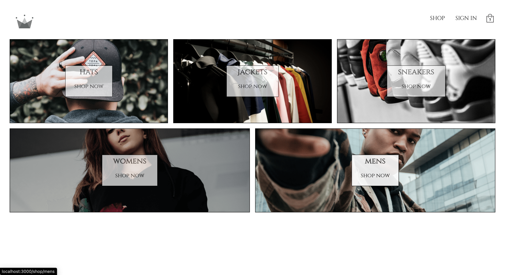
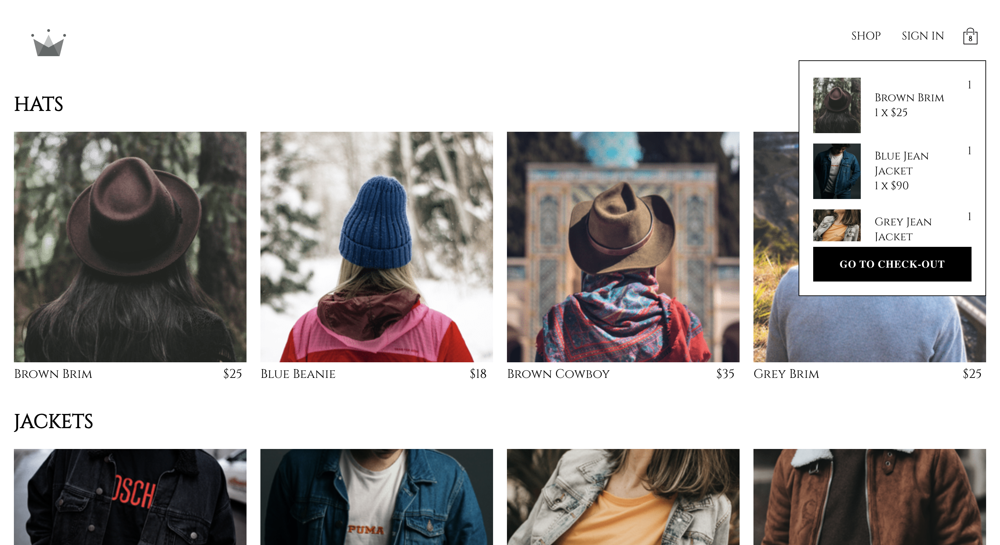
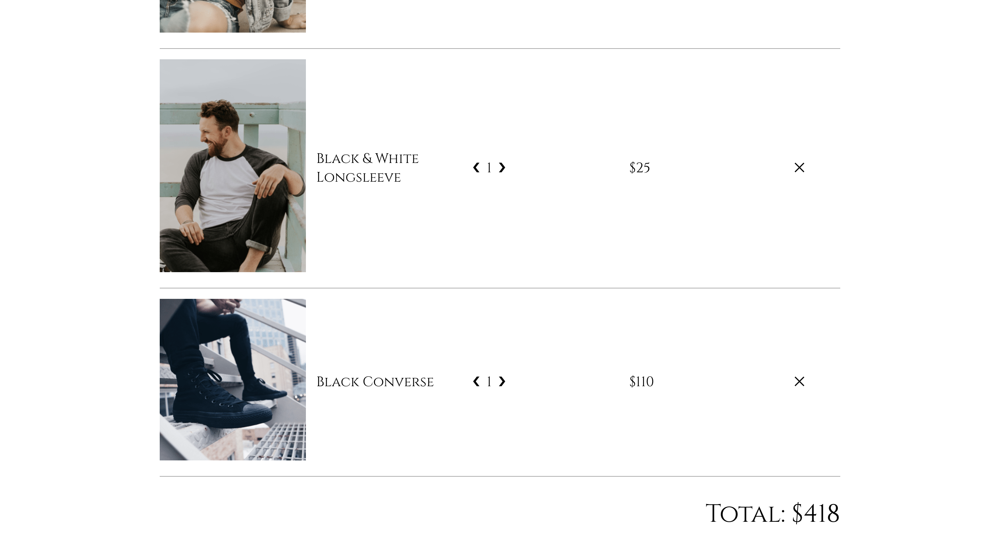
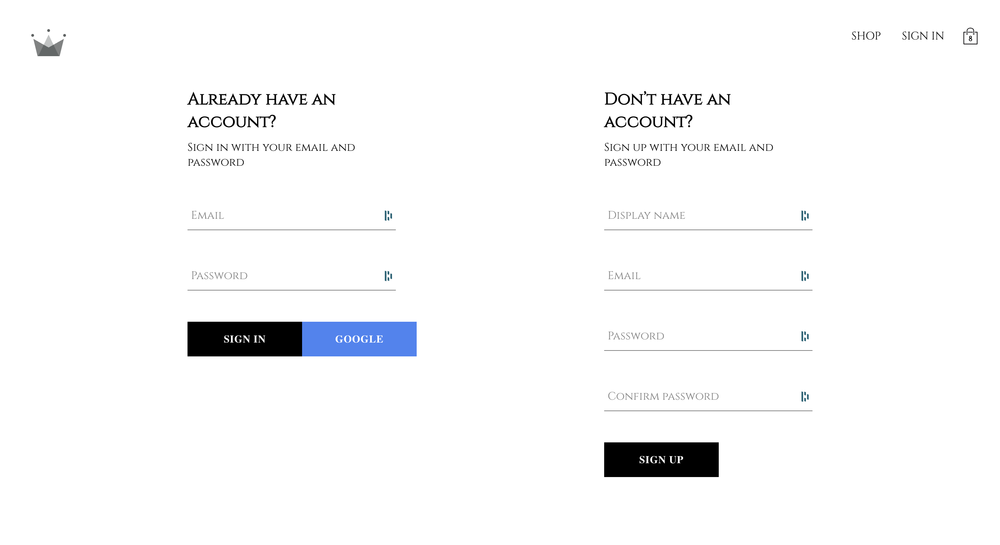

# Clothing outlet SPA

This is a demo e-commerce SPA for a mock clothing company ‘Crown Clothing’. The site includes five product pages, a sign-in page and a check-out page. React Routes is employed to help cross-page navigation. React Context is used to propogate the dataset stored on Firestore throughout the SPA. Context is also used to keep track of products that had been added to the user carts. The sign-in system is integrated with Firebase and allows for Google sign in as well as regular email and password. Context is used to ensure the user stays signed in between pages.

## Demo pics

The first image shows the landing page. Each tile animates a slow zoom on hover.

The second image shows the ‘Hats’ product page. This is a reusable product page component that checks the route the user has navigated to then draws the corresponding set of products to populate the page. The product details are pulled from Firestore and propogated through the site using React Context. Users can add products on this page to their cart, which adds items to the cart context from the categories context. This design would allow for easy scaling, as the company would simply need to add categories to the original dataset for the changes to be reflected on the site.

The third image shows the dropdown menu, which shows the user what’s currently in their cart, along with a link to the check-out page. The dropdown menu is populated from the cart context.

The fourth image shows the check-out page. Here the user can see a summary of the items they’ve added to their cart, including the number of each item they have (which they can increase, decrease or delete) and the total for each item. It also shows the grand total of all items in the cart.

The fifth image shows the sign-in page, which allows users to add an account or sign in to a pre-existing account. This system uses the in-built methods in the Firebase package to get authorisation, create user with email and password, sign in, sign out and track auth state change. It also uses Google auth to create accounts tied to a user’s Google account. This uses context to hold the users sign-in state as they continue to navigate the SPA.

